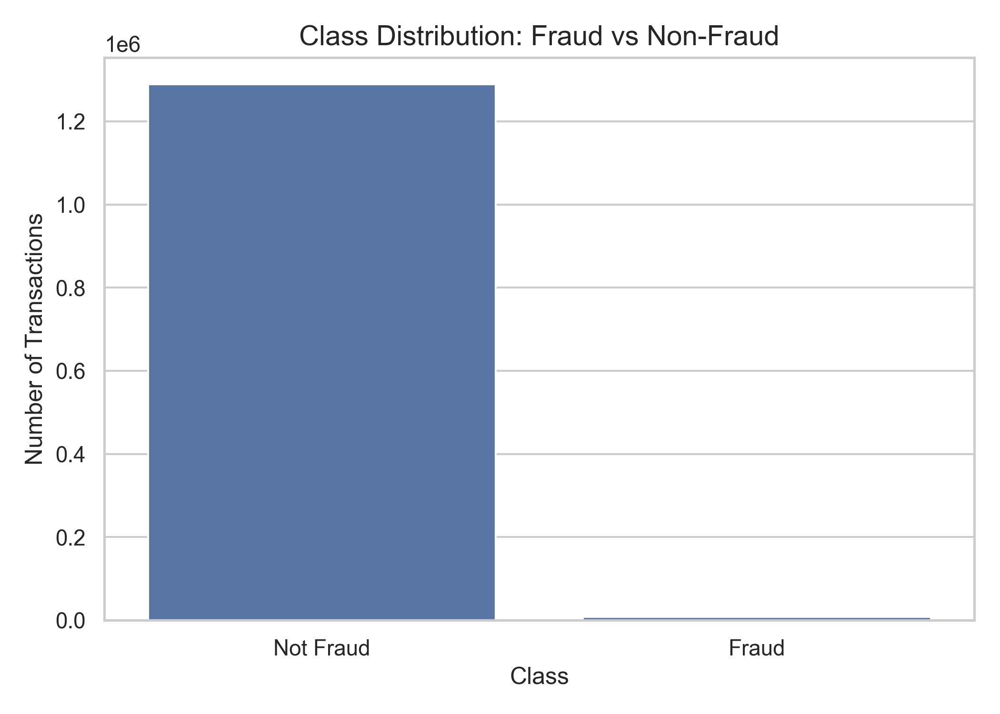
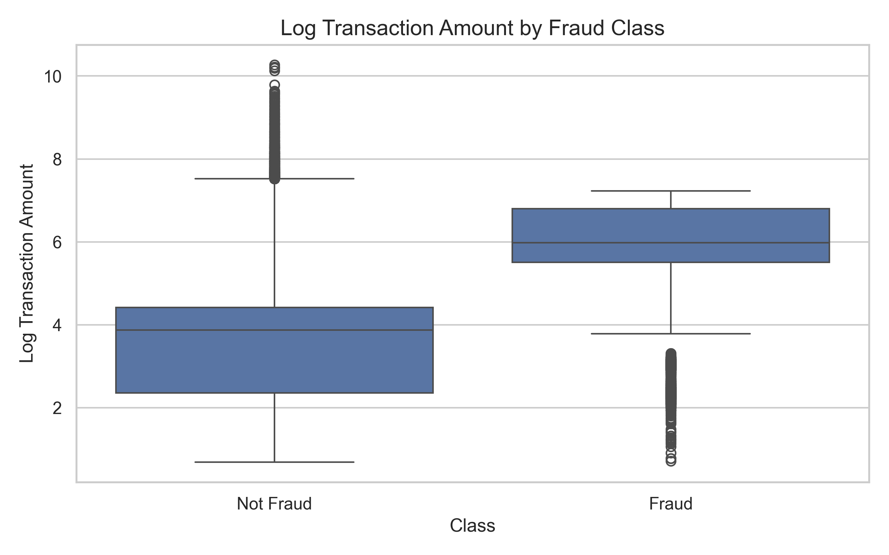
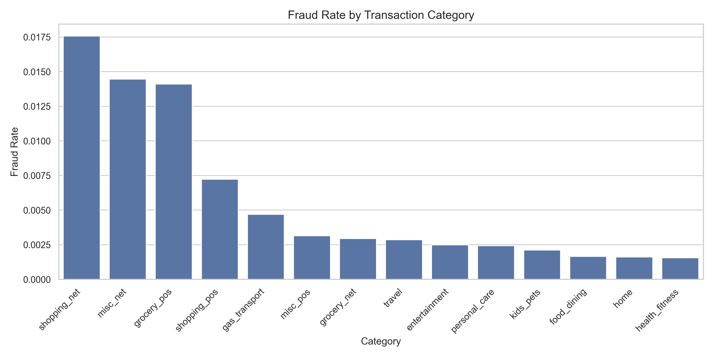
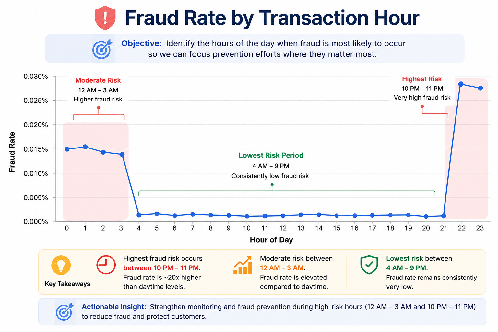
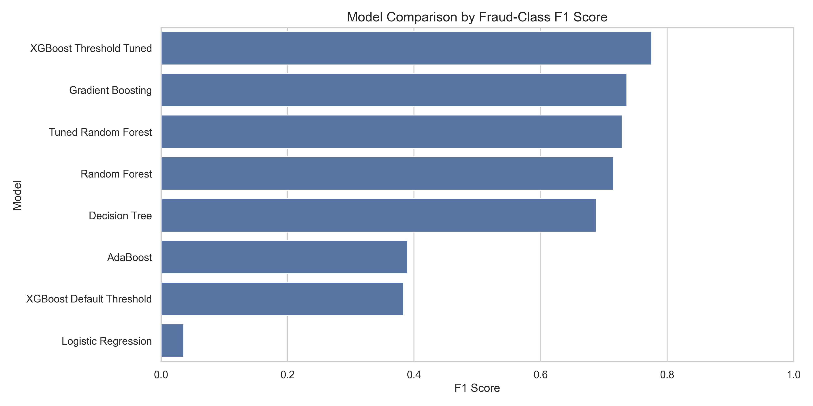
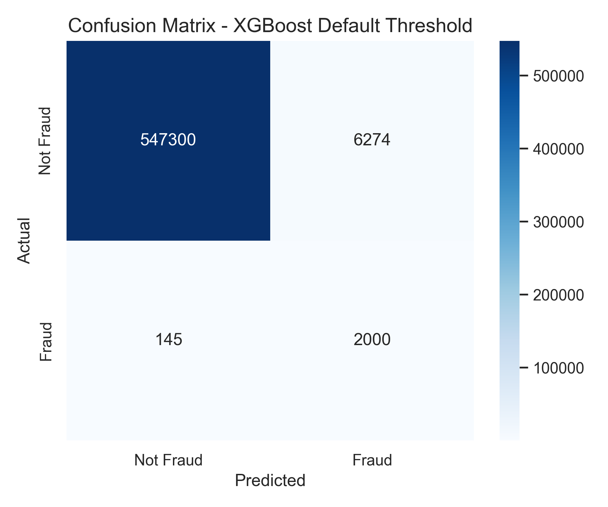
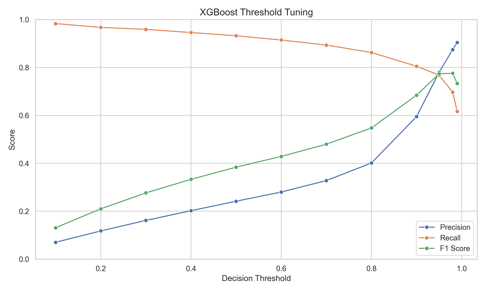
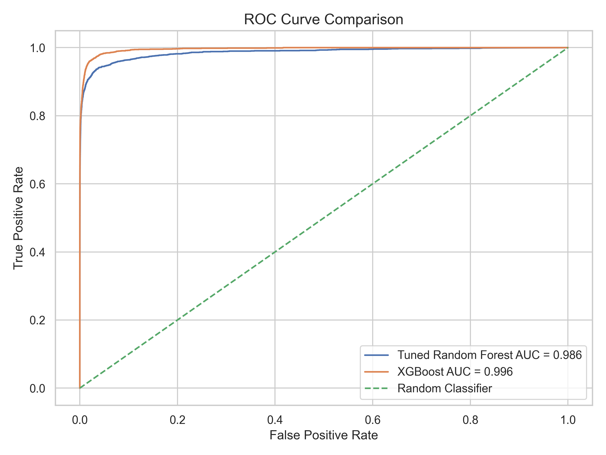
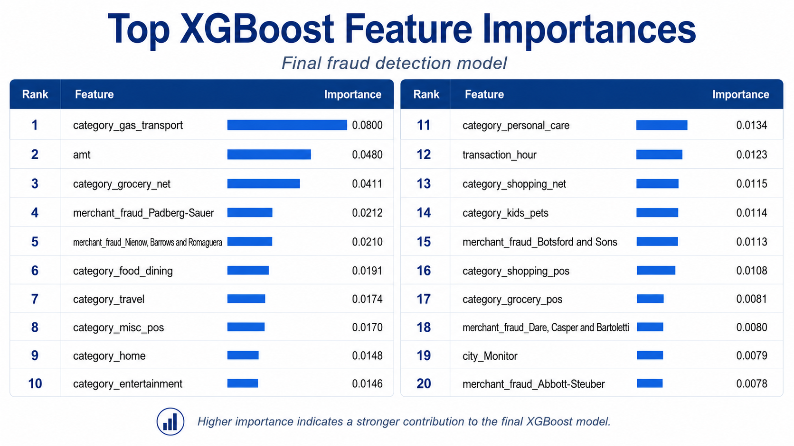

# Credit Card Fraud Detection

A machine learning project for detecting fraudulent credit card transactions using supervised classification models, feature engineering, model comparison, hyperparameter tuning, and decision-threshold optimization.

The goal of this project was to build a model that can detect fraud while keeping false fraud alerts reasonable. Since fraud cases are rare compared to normal transactions, this is an imbalanced classification problem. Because of that, the project focuses on precision, recall, F1-score, ROC-AUC, and confusion matrices instead of accuracy alone.

---

## Project Summary

Credit card fraud detection is difficult because most transactions are legitimate, while fraud cases make up a very small percentage of the data. A model can get high accuracy by mostly predicting “not fraud,” but that does not mean it is useful for detecting fraud.

This project compares several machine learning models:

- Logistic Regression
- Decision Tree
- Random Forest
- Gradient Boosting
- AdaBoost
- XGBoost

After comparing models and tuning thresholds, the final selected model was:

**XGBoost with a decision threshold of 0.98**

Final model performance:

| Metric | Score |
|---|---:|
| Accuracy | 0.9984 |
| Precision | 0.8748 |
| Recall | 0.6970 |
| F1-score | 0.7758 |
| ROC-AUC | 0.9957 |
| Threshold | 0.98 |

The final model correctly detected **1,495 fraud transactions** and falsely flagged only **214 normal transactions** as fraud.

---

## Dataset

The project uses a simulated credit card transaction dataset from Kaggle. The dataset includes transaction details, merchant information, customer information, location data, and a fraud label.

The original train/test split was kept:

- `fraudTrain.csv` was used for training
- `fraudTest.csv` was used for final testing

Dataset size:

| Dataset | Rows | Columns |
|---|---:|---:|
| Training set | 1,296,675 | 23 |
| Testing set | 555,719 | 23 |

Target column:

| Value | Meaning |
|---|---|
| `0` | Not Fraud |
| `1` | Fraud |

---

## Class Imbalance

The dataset is highly imbalanced. Most transactions are normal, while fraud cases make up less than 1% of the data.



This is why accuracy alone was not enough. A model could predict almost everything as “not fraud” and still look accurate. For this project, the main evaluation metrics were:

- Precision
- Recall
- F1-score
- ROC-AUC
- Confusion matrix

---

## Exploratory Data Analysis

Before training the models, I explored the dataset to understand patterns connected to fraud.

### Transaction Amount

Fraud transactions tended to have higher transaction amounts. Since the raw transaction amount had large outliers, I used a log transformation to make the pattern easier to compare.



This showed that transaction amount was useful for fraud prediction.

### Fraud Rate by Category

Fraud rates were different across transaction categories.



Some categories had higher fraud rates than others, which made transaction category an important feature for the models.

### Fraud Rate by Transaction Hour

Fraud risk also changed depending on the transaction hour.



Late-night hours showed higher fraud rates compared to most daytime hours. This supported creating and using `transaction_hour` as a feature.

---

## Data Preprocessing

The raw dataset included numeric columns, categorical string columns, date columns, and personal identifier columns. These had to be cleaned before training the models.

Main preprocessing steps:

1. Kept the original train/test split
2. Converted date columns into datetime format
3. Created time-based features
4. Created customer age
5. Created log transaction amount
6. Dropped personal and ID columns
7. One-hot encoded categorical columns
8. Scaled numeric columns

### Feature Engineering

The following features were created:

| Feature | Description |
|---|---|
| `transaction_hour` | Hour of the transaction |
| `transaction_day` | Day of the month |
| `transaction_month` | Month of the transaction |
| `transaction_dayofweek` | Day of the week |
| `age` | Customer age at time of transaction |
| `log_amt` | Log-transformed transaction amount |

### Dropped Columns

Some columns were removed because they were identifiers, personal information, or not useful for general prediction.

| Dropped Column | Reason |
|---|---|
| `Unnamed: 0` | Index column |
| `cc_num` | Credit card identifier |
| `first` | Personal name |
| `last` | Personal name |
| `street` | Personal address |
| `trans_num` | Unique transaction ID |
| `dob` | Replaced with age |
| `unix_time` | Redundant time representation |
| `trans_date_trans_time` | Replaced with engineered time features |

Categorical features such as merchant, category, gender, city, state, and job were one-hot encoded. Numeric features were scaled using `StandardScaler`.

---

## Models Tested

The models were trained using the same preprocessing pipeline so the comparison was consistent.

### Logistic Regression

Logistic Regression was used as the first baseline model. It was simple and easy to interpret, but it struggled with the fraud class.

| Metric | Score |
|---|---:|
| Precision | 0.0192 |
| Recall | 0.3301 |
| F1-score | 0.0362 |
| ROC-AUC | 0.6446 |

This showed that a simple linear model was not strong enough for this dataset.

### Decision Tree

Decision Tree performed better than Logistic Regression and had strong recall, but it had weaker precision than the stronger ensemble models.

| Metric | Score |
|---|---:|
| Precision | 0.6505 |
| Recall | 0.7305 |
| F1-score | 0.6882 |
| ROC-AUC | 0.8645 |

### Random Forest

Random Forest improved performance by combining many decision trees. The baseline Random Forest had very high precision but lower recall.

| Metric | Score |
|---|---:|
| Precision | 0.9659 |
| Recall | 0.5683 |
| F1-score | 0.7156 |
| ROC-AUC | 0.9700 |

### Gradient Boosting

Gradient Boosting was one of the strongest untuned baseline models.

| Metric | Score |
|---|---:|
| Precision | 0.7807 |
| Recall | 0.6970 |
| F1-score | 0.7365 |
| ROC-AUC | 0.9716 |

### AdaBoost

AdaBoost performed better than Logistic Regression but was weaker than the strongest models.

| Metric | Score |
|---|---:|
| Precision | 0.6950 |
| Recall | 0.2709 |
| F1-score | 0.3898 |
| ROC-AUC | 0.9765 |

---

## Model Comparison

The models were compared mainly using fraud-class F1-score because F1-score balances precision and recall.



Full model comparison:

| Model | Accuracy | Precision | Recall | F1-score | ROC-AUC | Threshold |
|---|---:|---:|---:|---:|---:|---:|
| XGBoost Threshold Tuned | 0.9984 | 0.8748 | 0.6970 | 0.7758 | 0.9957 | 0.98 |
| Gradient Boosting | 0.9981 | 0.7807 | 0.6970 | 0.7365 | 0.9716 | - |
| Tuned Random Forest | 0.9980 | 0.7542 | 0.7054 | 0.7290 | 0.9860 | 0.50 |
| Random Forest | 0.9983 | 0.9659 | 0.5683 | 0.7156 | 0.9700 | - |
| Decision Tree | 0.9974 | 0.6505 | 0.7305 | 0.6882 | 0.8645 | - |
| AdaBoost | 0.9967 | 0.6950 | 0.2709 | 0.3898 | 0.9765 | - |
| XGBoost Default Threshold | 0.9884 | 0.2417 | 0.9324 | 0.3839 | 0.9957 | 0.50 |
| Logistic Regression | 0.9323 | 0.0192 | 0.3301 | 0.0362 | 0.6446 | - |

---

## Random Forest Tuning

Random Forest was one of the strongest models, so I tuned it using `RandomizedSearchCV`.

I used `RandomizedSearchCV` instead of `GridSearchCV` because the dataset is large, and testing every possible parameter combination would take much longer.

The tuned Random Forest achieved:

| Metric | Score |
|---|---:|
| Precision | 0.7542 |
| Recall | 0.7054 |
| F1-score | 0.7290 |
| ROC-AUC | 0.9860 |
| Best Threshold | 0.50 |


Tuned Random Forest summary:

| Result | Count |
|---|---:|
| Correctly detected fraud | 1,513 |
| Missed fraud cases | 632 |
| False positives | 493 |

Random Forest performed well, but XGBoost later gave a better F1-score and fewer false positives.

---

## XGBoost Default Threshold

XGBoost was tested as an advanced boosting model. At the default threshold of `0.50`, it caught most fraud cases, but it also created too many false positives.



Default XGBoost results:

| Metric | Score |
|---|---:|
| Precision | 0.2417 |
| Recall | 0.9324 |
| F1-score | 0.3839 |
| ROC-AUC | 0.9957 |

At the default threshold, XGBoost detected **2,000 out of 2,145 fraud cases**, but it also created **6,274 false positives**. This showed that the model was too aggressive and needed threshold tuning.

---

## XGBoost Threshold Tuning

Since the default XGBoost threshold created too many false positives, I tested thresholds from `0.10` to `0.99`.



The threshold tuning showed the tradeoff between precision and recall:

- Lower thresholds increased recall but created more false positives.
- Higher thresholds increased precision but missed more fraud cases.
- The best F1-score occurred at threshold `0.98`.

This threshold gave the best balance between detecting fraud and avoiding too many false alerts.

---

## Final Model: XGBoost with Threshold 0.98

The final selected model was XGBoost with a decision threshold of `0.98`.

Final model performance:

| Metric | Score |
|---|---:|
| Accuracy | 0.9984 |
| Precision | 0.8748 |
| Recall | 0.6970 |
| F1-score | 0.7758 |
| ROC-AUC | 0.9957 |
| Threshold | 0.98 |


Final confusion matrix summary:

| Result | Count |
|---|---:|
| Correctly predicted not fraud | 553,360 |
| False positives | 214 |
| Missed fraud cases | 650 |
| Correctly detected fraud | 1,495 |

Compared to Random Forest, XGBoost missed slightly more fraud cases, but it greatly reduced false positives and achieved a better F1-score.

---

## ROC-AUC Comparison

ROC-AUC was used to measure how well the models separated fraud from non-fraud transactions.



XGBoost had the strongest ROC-AUC score:

| Model | ROC-AUC |
|---|---:|
| XGBoost | 0.9957 |
| Tuned Random Forest | 0.9860 |

Both models performed well, but XGBoost had the stronger overall ranking ability.

---

## Feature Importance

Feature importance was used to understand which features contributed most to the final XGBoost model.



The most important feature groups were:

- Transaction category
- Transaction amount
- Merchant information
- Transaction hour

This matched the exploratory analysis. Fraud rates changed by category, fraud transactions showed transaction amount patterns, and transaction hour showed useful time-based patterns.

---

## Final Conclusion

Fraud detection was challenging because the dataset was highly imbalanced. Logistic Regression was a weak baseline, while tree-based and boosting models performed much better.

Random Forest improved after hyperparameter tuning and achieved strong results. However, XGBoost became the final model after threshold tuning because it had:

- The best F1-score
- The highest ROC-AUC
- Strong precision
- Fewer false positives than tuned Random Forest
- A good balance between catching fraud and avoiding unnecessary false alerts

The final selected model was:

**XGBoost with threshold 0.98**

Final result:

| Metric | Score |
|---|---:|
| Precision | 0.8748 |
| Recall | 0.6970 |
| F1-score | 0.7758 |
| ROC-AUC | 0.9957 |

---

## Project Structure

```text
credit-card-fraud-detection-machine-learning/
│
├── data/
│   └── archive/
│       ├── fraudTrain.csv
│       └── fraudTest.csv
│
├── src/
│   ├── main.ipynb
│   │
│   └── reports/
│       ├── figures/
│       │   ├── Feature_importance.png
│       │   ├── class_distribution.png
│       │   ├── confusion_matrix_final_xgboost.png
│       │   ├── confusion_matrix_tuned_random_forest.png
│       │   ├── confusion_matrix_xgboost_default.png
│       │   ├── fraud_rate_by_category.png
│       │   ├── fraud_rate_by_hour.png
│       │   ├── fraud_rate_by_hourV2.png
│       │   ├── log_amount_by_fraud_class.png
│       │   ├── model_comparison_f1_score.png
│       │   ├── roc_curve_comparison.png
│       │   ├── xgboost_feature_importance.png
│       │   └── xgboost_threshold_tuning.png
│       │
│       └── tables/
│           ├── final_model_results.csv
│           ├── random_forest_threshold_results.csv
│           ├── xgboost_feature_importance.csv
│           └── xgboost_threshold_results.csv
│
├── README.md
└── requirements.txt
```

---

## Technologies Used

- Python
- pandas
- NumPy
- scikit-learn
- XGBoost
- matplotlib
- seaborn
- Jupyter Notebook

---

## How to Run the Project

1. Clone the repository:

```bash
git clone <your-repo-url>
cd credit-card-fraud-detection-machine-learning
```

2. Install dependencies:

```bash
pip install -r requirements.txt
```

or, if using `uv`:

```bash
uv sync
```

3. Place the dataset files in:

```text
data/archive/
```

Expected files:

```text
fraudTrain.csv
fraudTest.csv
```

4. Open and run the notebook:

```text
src/main.ipynb
```

The notebook generates plots and report tables under:

```text
src/reports/
```

---

## References

Datasets:

- Kaggle Fraud Detection Dataset
- Kaggle Credit Card Fraud Detection Dataset 2023

Libraries:

- pandas
- NumPy
- scikit-learn
- XGBoost
- matplotlib
- seaborn
