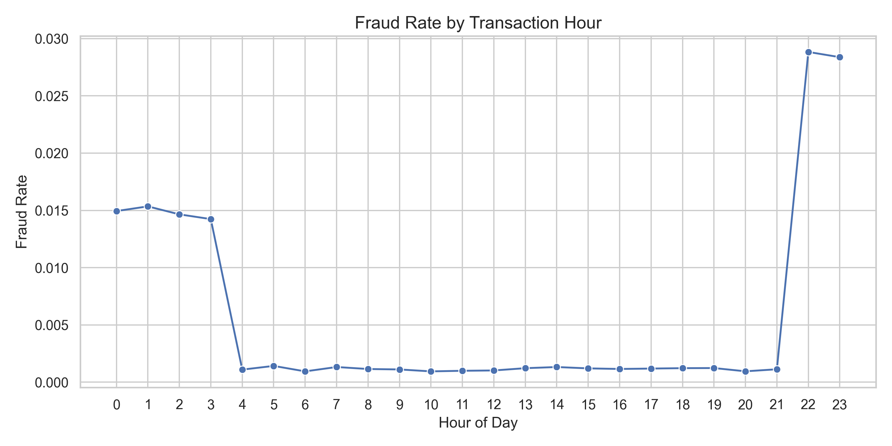

# Credit Card Fraud Detection

A machine learning project for detecting fraudulent credit card transactions using supervised classification models, feature engineering, model comparison, hyperparameter tuning, and decision-threshold optimization.

The goal of this project was not just to build a model with high accuracy, but to build a model that can identify fraud cases while keeping false fraud alerts reasonable. Since fraud is rare, the dataset is highly imbalanced, which makes this a more realistic classification problem than a simple accuracy-based model.

## Project Summary

Credit card fraud detection is a difficult machine learning problem because most transactions are legitimate, while fraud cases make up only a very small portion of the data. This means a model can achieve high accuracy by mostly predicting “not fraud,” even if it performs poorly at actually detecting fraud.

Because of that, this project focuses on fraud-class performance using precision, recall, F1-score, ROC-AUC, and confusion matrices.

Several models were trained and compared, including Logistic Regression, Decision Tree, Random Forest, Gradient Boosting, AdaBoost, and XGBoost. After model comparison and threshold tuning, the best final model was:

**XGBoost with a decision threshold of 0.98**

Final model performance:

| Metric | Score |
|---|---:|
| Accuracy | 0.9984 |
| Precision | 0.8748 |
| Recall | 0.6970 |
| F1-score | 0.7758 |
| ROC-AUC | 0.9957 |
| Threshold | 0.98 |

The final model correctly detected **1,495 fraud transactions** while only falsely flagging **214 normal transactions** as fraud.

---

## Problem Statement

The objective of this project was to train a machine learning model that can classify credit card transactions as either fraudulent or legitimate.

In real fraud detection systems, the cost of different errors is not the same:

- Missing a fraud transaction is risky because fraudulent activity may continue.
- Incorrectly flagging a normal transaction can frustrate customers and create unnecessary review work.
- A useful model needs a balance between catching fraud and avoiding too many false alarms.

For that reason, this project does not rely on accuracy alone. Instead, the final model was selected based on the balance between precision, recall, F1-score, ROC-AUC, and confusion matrix results.

---

## Dataset

The project uses a simulated credit card transaction dataset from Kaggle. The data was generated to mirror real-world transaction behavior and includes transaction details, customer information, merchant information, location data, and a fraud label.

The dataset already provides separate training and testing files, so I kept the original split:

- `fraudTrain.csv` was used for training
- `fraudTest.csv` was used for final testing

Dataset size:

| Dataset | Rows | Columns |
|---|---:|---:|
| Training set | 1,296,675 | 23 |
| Testing set | 555,719 | 23 |

Target column:

| Value | Meaning |
|---|---|
| `0` | Not Fraud |
| `1` | Fraud |

The fraud class is very small compared to the non-fraud class, which makes this an imbalanced classification problem.

---

## Class Imbalance

One of the biggest challenges in this project was the class imbalance. Fraud cases made up less than 1% of the dataset.


This matters because a model can have very high accuracy while still missing many fraud cases. For example, if almost every transaction is not fraud, a model that predicts “not fraud” most of the time can appear accurate but still fail at the actual task.

Because of this, the project focuses more on:

- Precision
- Recall
- F1-score
- ROC-AUC
- Confusion matrix

---

## Exploratory Data Analysis

Before training models, I explored the dataset to understand fraud patterns and decide which features could be useful.

### Transaction Amount

Fraud transactions tended to have higher transaction amounts. Since the raw transaction amount had large outliers, I used a log transformation to make the pattern easier to compare.


This showed that transaction amount was likely to be useful for fraud prediction.

### Fraud Rate by Category

Fraud rates were not evenly distributed across transaction categories. Some categories had noticeably higher fraud rates than others.


Categories such as online shopping and miscellaneous online transactions showed higher fraud rates. This supported keeping transaction category as an important categorical feature.

### Fraud Rate by Transaction Hour

Fraud risk also changed depending on the hour of the transaction.



Late-night transaction hours showed higher fraud rates compared to most daytime hours. This supported creating a `transaction_hour` feature during preprocessing.

---

## Data Preprocessing

The raw dataset contained numeric columns, categorical string columns, date columns, and personal identifier columns. Since machine learning models require numeric input, preprocessing was needed before model training.

The main preprocessing steps were:

1. Kept the original train/test split
2. Converted date columns into datetime format
3. Created time-based features
4. Created customer age
5. Created log transaction amount
6. Dropped personal and ID columns
7. One-hot encoded categorical columns
8. Scaled numeric columns

### Feature Engineering

The original datetime columns were converted into useful model features:

| New Feature | Description |
|---|---|
| `transaction_hour` | Hour of the transaction |
| `transaction_day` | Day of the month |
| `transaction_month` | Month of the transaction |
| `transaction_dayofweek` | Day of the week |
| `age` | Customer age at time of transaction |
| `log_amt` | Log-transformed transaction amount |

### Dropped Columns

Some columns were removed because they were identifiers, personal information, or not useful for general prediction.

| Dropped Column | Reason |
|---|---|
| `Unnamed: 0` | Index column |
| `cc_num` | Credit card identifier |
| `first` | Personal name |
| `last` | Personal name |
| `street` | Personal address |
| `trans_num` | Unique transaction ID |
| `dob` | Replaced with age |
| `unix_time` | Redundant time representation |
| `trans_date_trans_time` | Replaced with engineered time features |

Categorical features such as merchant, category, gender, city, state, and job were encoded using one-hot encoding. Numeric features were scaled using `StandardScaler`.

---

## Models Tested

I trained and compared multiple classification models:

- Logistic Regression
- Decision Tree
- Random Forest
- Gradient Boosting
- AdaBoost
- XGBoost

The purpose of testing multiple models was to compare simple linear models, tree-based models, ensemble methods, and boosting methods.

### Logistic Regression Baseline

Logistic Regression was used as the first baseline model because it is simple, interpretable, and commonly used for binary classification.

However, it performed poorly on the fraud class:

| Metric | Score |
|---|---:|
| Precision | 0.0192 |
| Recall | 0.3301 |
| F1-score | 0.0362 |
| ROC-AUC | 0.6446 |

This showed that a simple linear model was not strong enough for this dataset.

### Tree-Based and Boosting Models

Tree-based models performed much better because they can capture nonlinear relationships between transaction features.

Decision Tree had strong recall but weaker precision. Random Forest improved performance by combining many trees. Gradient Boosting was one of the strongest untuned models. AdaBoost improved over Logistic Regression but was weaker than the strongest models.

---

## Model Comparison

The models were compared mainly by fraud-class F1-score because F1-score balances precision and recall.


Full model comparison:

| Model | Accuracy | Precision | Recall | F1-score | ROC-AUC | Threshold |
|---|---:|---:|---:|---:|---:|---:|
| XGBoost Threshold Tuned | 0.9984 | 0.8748 | 0.6970 | 0.7758 | 0.9957 | 0.98 |
| Gradient Boosting | 0.9981 | 0.7807 | 0.6970 | 0.7365 | 0.9716 | - |
| Tuned Random Forest | 0.9980 | 0.7542 | 0.7054 | 0.7290 | 0.9860 | 0.50 |
| Random Forest | 0.9983 | 0.9659 | 0.5683 | 0.7156 | 0.9700 | - |
| Decision Tree | 0.9974 | 0.6505 | 0.7305 | 0.6882 | 0.8645 | - |
| AdaBoost | 0.9967 | 0.6950 | 0.2709 | 0.3898 | 0.9765 | - |
| XGBoost Default Threshold | 0.9884 | 0.2417 | 0.9324 | 0.3839 | 0.9957 | 0.50 |
| Logistic Regression | 0.9323 | 0.0192 | 0.3301 | 0.0362 | 0.6446 | - |

---

## Random Forest Tuning

Random Forest was one of the strongest models, so I tuned it using `RandomizedSearchCV`.

RandomizedSearchCV was used instead of GridSearchCV because the dataset is large, and an exhaustive grid search would be computationally expensive.

The tuned Random Forest achieved:

| Metric | Score |
|---|---:|
| Precision | 0.7542 |
| Recall | 0.7054 |
| F1-score | 0.7290 |
| ROC-AUC | 0.9860 |
| Best Threshold | 0.50 |


Tuned Random Forest confusion matrix summary:

| Result | Count |
|---|---:|
| Correctly detected fraud | 1,513 |
| Missed fraud cases | 632 |
| False positives | 493 |

Random Forest performed well, but XGBoost later gave a better F1-score and fewer false positives.

---

## XGBoost Default Threshold

XGBoost was tested as an advanced boosting model. At the default threshold of `0.50`, it caught most fraud cases, but it also flagged too many normal transactions as fraud.


Default XGBoost results:

| Metric | Score |
|---|---:|
| Precision | 0.2417 |
| Recall | 0.9324 |
| F1-score | 0.3839 |
| ROC-AUC | 0.9957 |

At the default threshold, XGBoost detected 2,000 out of 2,145 fraud cases, but it also created 6,274 false positives. This showed that the model was too aggressive and needed threshold tuning.

---

## XGBoost Threshold Tuning

Since the default XGBoost threshold created too many false positives, I tested thresholds from `0.10` to `0.99`.


The threshold tuning showed the tradeoff between precision and recall:

- Lower thresholds increased recall but created more false positives.
- Higher thresholds increased precision but missed more fraud cases.
- The best F1-score occurred at threshold `0.98`.

This threshold gave the best balance between detecting fraud and avoiding too many false alerts.

---

## Final Model: XGBoost with Threshold 0.98

The final selected model was XGBoost with a decision threshold of `0.98`.

Final model performance:

| Metric | Score |
|---|---:|
| Accuracy | 0.9984 |
| Precision | 0.8748 |
| Recall | 0.6970 |
| F1-score | 0.7758 |
| ROC-AUC | 0.9957 |
| Threshold | 0.98 |


Final confusion matrix summary:

| Result | Count |
|---|---:|
| Correctly predicted not fraud | 553,360 |
| False positives | 214 |
| Missed fraud cases | 650 |
| Correctly detected fraud | 1,495 |

Compared to Random Forest, XGBoost missed slightly more fraud cases, but it greatly reduced false positives and achieved a better F1-score.

---

## ROC-AUC Comparison

ROC-AUC was used to measure how well the models separated fraud from non-fraud transactions.


XGBoost had the strongest ROC-AUC score:

| Model | ROC-AUC |
|---|---:|
| XGBoost | 0.9957 |
| Tuned Random Forest | 0.9860 |

Both models performed well, but XGBoost had the stronger overall ranking ability.

---

## Feature Importance

Feature importance was used to understand what the final XGBoost model relied on most.


The most important feature groups were:

- Transaction category
- Transaction amount
- Merchant information
- Transaction hour

This matched the earlier exploratory analysis. Fraud rates changed by category, fraud transactions tended to have different transaction amounts, and transaction hour showed useful time-based patterns.

---

## Final Conclusion

Fraud detection was challenging because the dataset was highly imbalanced. Logistic Regression was a weak baseline, while tree-based and boosting models performed much better.

Random Forest improved after hyperparameter tuning and achieved strong results. However, XGBoost became the final model after threshold tuning because it had:

- The best F1-score
- The highest ROC-AUC
- Strong precision
- Fewer false positives than tuned Random Forest
- A good balance between catching fraud and avoiding unnecessary false alerts

The final selected model was:

**XGBoost with threshold 0.98**

Final result:

| Metric | Score |
|---|---:|
| Precision | 0.8748 |
| Recall | 0.6970 |
| F1-score | 0.7758 |
| ROC-AUC | 0.9957 |

---

## Project Structure

```text
credit-card-fraud-detection-machine-learning/
│
├── data/
│   └── archive/
│       ├── fraudTrain.csv
│       └── fraudTest.csv
│
├── src/
│   ├── main.ipynb
│   │
│   └── reports/
│       ├── figures/
│       │   ├── class_distribution.png
│       │   ├── log_amount_by_fraud_class.png
│       │   ├── fraud_rate_by_category.png
│       │   ├── fraud_rate_by_hour.png
│       │   ├── model_comparison_f1_score.png
│       │   ├── confusion_matrix_tuned_random_forest.png
│       │   ├── confusion_matrix_xgboost_default.png
│       │   ├── confusion_matrix_final_xgboost.png
│       │   ├── xgboost_threshold_tuning.png
│       │   ├── roc_curve_comparison.png
│       │   └── xgboost_feature_importance.png
│       │
│       └── tables/
│           ├── final_model_results.csv
│           ├── random_forest_threshold_results.csv
│           ├── xgboost_threshold_results.csv
│           └── xgboost_feature_importance.csv
│
├── README.md
└── requirements.txt
